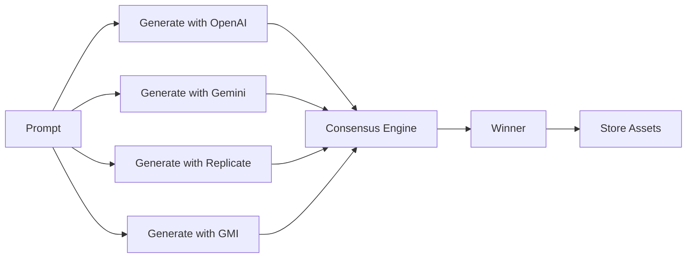
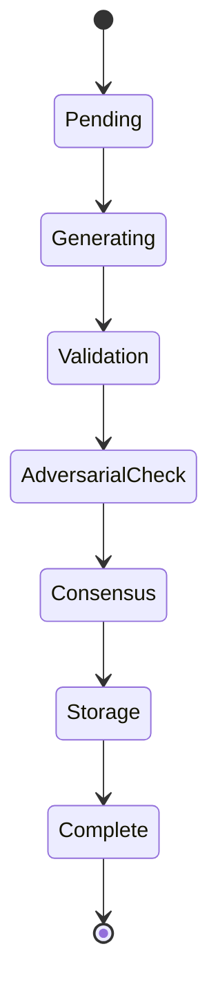
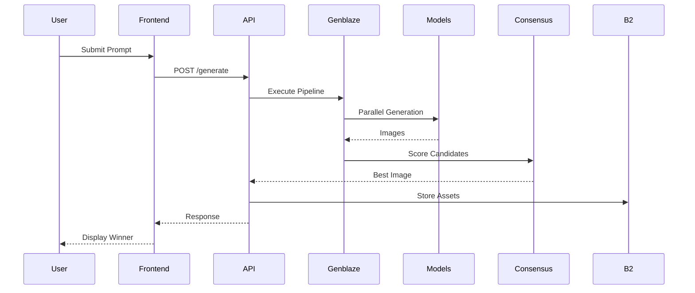

# VeriGen
### Multi-Model AI Consensus Engine for Trustworthy Generative Media

<p align="center">


</p>

---

## Overview

VeriGen is an enterprise-grade **AI consensus engine** that transforms generative media from an unpredictable process into a deterministic, auditable workflow.

Instead of relying on a single AI model, VeriGen submits prompts to multiple providers simultaneously, evaluates every candidate using an automated consensus scoring engine, selects the highest-quality result, and stores every artifact—including provenance metadata—inside **Backblaze B2 Cloud Storage**.

The result is a complete trust layer for enterprise AI media generation.

---

## Why VeriGen?

Modern generative AI suffers from several fundamental issues:

- inconsistent outputs
- hallucinations
- poor prompt adherence
- lack of provenance
- difficult compliance
- expensive manual review
- vendor lock-in

VeriGen solves these problems using a consensus-based architecture.

```
              Traditional AI

              Prompt
                 │
                 ▼
          Single AI Model
                 │
                 ▼
          Unknown Quality
                 │
                 ▼
            Human Review
                 │
                 ▼
             Production


               VeriGen

              Prompt
                 │
                 ▼
     ┌─────────────────────────┐
     │ Multi-Provider Engine    │
     └─────────────────────────┘
       │     │      │      │
       ▼     ▼      ▼      ▼
   OpenAI  Gemini Replicate GMI
       │     │      │      │
       └─────┴──────┴──────┘
                 │
                 ▼
       Consensus Scoring Engine
                 │
                 ▼
          Best Candidate Selected
                 │
                 ▼
      Provenance + Audit Manifest
                 │
                 ▼
         Backblaze B2 Storage
```

---

# Features

## Multi-Model Consensus

Generate media using multiple providers simultaneously.

Supported providers include

- OpenAI
- Google
- Replicate
- GMI Cloud
- Future Provider Plugins

---

## Automated Quality Scoring

Each generated candidate receives scores across several dimensions.

| Metric | Description |
|----------|-------------|
| Prompt Adherence | Matches user request |
| Image Quality | Visual fidelity |
| Diversity | Uniqueness |
| Robustness | Handles edge cases |
| Artifact Detection | Detects AI failures |
| Confidence | Overall consensus |

Final score:

```
Consensus Score

=

0.40 × Prompt Quality

+

0.25 × Visual Quality

+

0.20 × Robustness

+

0.15 × Diversity
```

---

## Immutable Provenance

Every generation creates a complete audit trail.

```
Generation Request

      │

      ▼

Prompt

      │

      ▼

Provider Metadata

      │

      ▼

Model Version

      │

      ▼

Generation Parameters

      │

      ▼

SHA256 Hash

      │

      ▼

Consensus Report

      │

      ▼

Stored in Backblaze B2
```

---

## Backblaze B2 Integration

Every generated asset is permanently organized.

```
jobs/

 ├── job_001/

 │      ├── candidates/

 │      │      ├── openai.png

 │      │      ├── gemini.png

 │      │      ├── replicate.png

 │      │      └── metadata.json

 │      │

 │      ├── winner/

 │      │      ├── image.png

 │      │      └── manifest.json

 │      │

 │      └── consensus.json
```

Advantages

- durable storage
- low cost
- S3 compatible
- immutable records
- enterprise security

---

# Architecture

## High-Level System

```text
                        Browser

                           │

                           ▼

                  Next.js Frontend

                           │ REST

                           ▼

                  FastAPI Backend

                           │

                           ▼

                 Genblaze Orchestrator

      ┌──────────┬─────────────┬────────────┐

      ▼          ▼             ▼            ▼

   OpenAI     Google      Replicate      GMI

      └──────────┬─────────────┬────────────┘

                 ▼

        Consensus Engine

                 │

                 ▼

          Provenance Builder

                 │

                 ▼

          Backblaze B2 Cloud
```

---

# Consensus Pipeline



---

# Consensus State Machine



---

# Repository Layout

```text
verigen/

├── frontend/

│      ├── app/

│      ├── components/

│      ├── lib/

│      └── hooks/

│

├── backend/

│      ├── api/

│      ├── consensus/

│      ├── providers/

│      ├── storage/

│      └── provenance/

│

├── docker/

├── docs/

├── scripts/

├── tests/

└── README.md
```

---

# Technology Stack

| Layer | Technology |
|---------|------------|
| Frontend | Next.js |
| Backend | FastAPI |
| Language | Python |
| UI | React |
| Storage | Backblaze B2 |
| Orchestration | Genblaze |
| Image Models | OpenAI, Google, Replicate |
| Metadata | JSON |
| Provenance | SHA-256 |
| Deployment | Docker |

---

# Generation Workflow



---

# Installation

Clone the repository

```bash
git clone https://github.com/your-org/verigen.git

cd verigen
```

Install Python dependencies

```bash
pip install -r requirements.txt
```

Install frontend

```bash
npm install
```

Run backend

```bash
uvicorn app.main:app --reload
```

Run frontend

```bash
npm run dev
```

---

# Environment Variables

```bash
OPENAI_API_KEY=

GOOGLE_API_KEY=

REPLICATE_API_TOKEN=

B2_KEY_ID=

B2_APPLICATION_KEY=

B2_BUCKET=

DATABASE_URL=

LOG_LEVEL=INFO
```

---

# Example API

Create generation

```http
POST /api/generate
```

Request

```json
{
  "prompt": "Modern electric sports car in Tokyo",
  "models": [
    "openai",
    "gemini",
    "replicate"
  ]
}
```

Response

```json
{
  "winner":"openai",

  "score":96.8,

  "images":3,

  "manifest":"manifest.json",

  "storage":"b2://jobs/job123"
}
```

---

# Security

VeriGen provides enterprise-ready security.

- SHA-256 provenance manifests
- Immutable storage
- Signed metadata
- Audit trails
- Provider abstraction
- Secret isolation
- Environment variable configuration
- Object integrity verification

---

# Roadmap

- [x] Multi-model generation
- [x] Consensus scoring
- [x] Provenance manifests
- [x] Backblaze B2 integration
- [x] Genblaze orchestration
- [ ] Video generation
- [ ] Audio consensus
- [ ] LLM-as-a-Judge scoring
- [ ] C2PA content credentials
- [ ] Kubernetes deployment
- [ ] Enterprise SSO
- [ ] Distributed consensus workers

---

# Why VeriGen?

VeriGen transforms AI generation into a repeatable engineering workflow.

Instead of trusting one model, it combines the strengths of multiple providers, automatically identifies the best result, records complete provenance, and stores every artifact in Backblaze B2 for future verification.

By combining **Genblaze orchestration**, **multi-model consensus**, **cryptographic provenance**, and **Backblaze B2**, VeriGen delivers a production-ready platform for reliable AI-generated media.

---

<p align="center">

**Generate. Verify. Trust.**

*Consensus-Driven Generative AI.*

</p>
